<div align="center">

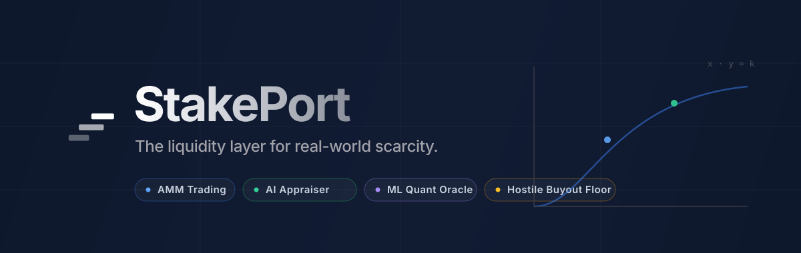

### The liquidity layer for real-world scarcity

Fractionalize, trade, and acquire high-value physical assets — luxury watches, exotic cars, art, real estate — with the UX of Polymarket and the financial robustness of Uniswap.

[](https://stake-port.vercel.app)
&nbsp;
[](https://nextjs.org)
[](https://soliditylang.org)
[](https://fastapi.tiangolo.com)
[](#-license)

**[Live Demo »](https://stake-port.vercel.app)** &nbsp;·&nbsp; **[Deployment Playbook »](DEPLOYMENT.md)**

</div>

---

## Table of Contents

- [The Problem](#-the-problem)
- [What StakePort Does](#-what-stakeport-does)
- [Screenshots](#-screenshots)
- [The Mechanism: Three Rails](#-the-mechanism-three-rails)
- [Arbitrage-Enforced Valuation](#-arbitrage-enforced-valuation-the-hostile-buyout)
- [The Asset Lifecycle](#-the-asset-lifecycle)
- [Feature Highlights](#-feature-highlights)
- [The AI / ML Stack](#-the-ai--ml-stack)
- [Smart Contract Internals](#-smart-contract-internals)
- [Architecture](#-architecture)
- [Tech Stack](#-tech-stack)
- [Repository Structure](#-repository-structure)
- [Getting Started (Local)](#-getting-started-local)
- [Deployment](#-deployment)
- [Roadmap](#-roadmap)
- [Disclaimer & License](#-disclaimer)

---

## 🧭 The Problem

Wealth has always traded on a different clock. A Patek Philippe that doubles in three years sits in a safe for a decade. A Manhattan penthouse takes eighteen months to clear escrow. The world's most valuable physical things **appreciate quietly and change hands rarely** — priced by closed circles of auction houses and private brokers, with thin buyer pools, opaque discovery, and theatrical liquidity.

At the same time, tokenizing these assets on-chain hits a fundamental wall: **the blockchain is blind to the real world.** An Automated Market Maker only knows the ratio of tokens in its pool — it has no idea what a Rolex or a plot of land is actually worth. Without a reliable anchor, a tokenized asset is wide open to manipulation, and buyers have no baseline to judge fair value.

**Scarcity was the moat. StakePort is filling it in.**

---

## 💡 What StakePort Does

StakePort is a decentralized exchange for physical scarcity. It combines four ideas that each fix a problem the others can't:

1. **An AMM** gives every fractional share an instant, algorithmic price — no order books, no waiting for counterparties.
2. **A multimodal AI appraiser** turns raw seller photos + notes into a standardized, Christie's-grade investment prospectus on every listing.
3. **An ML quant oracle** scrapes live real-world retail data and filters the noise to produce a defensible fair-value floor — the anchor the blockchain lacks.
4. **A dynamic hostile-buyout mechanism** uses trader greed to keep on-chain prices honest: undervaluation is never free money for long.

The result feels like a professional trading terminal — dark, dense, live — not a Web3 toy.

---

## 📸 Screenshots

> Live captures from the deployed app. *(Drop your PNGs into [`assets/screenshots/`](assets/screenshots/) — filenames are pre-wired below.)*

| The Landing | The Markets Terminal |
|:---:|:---:|
|  | 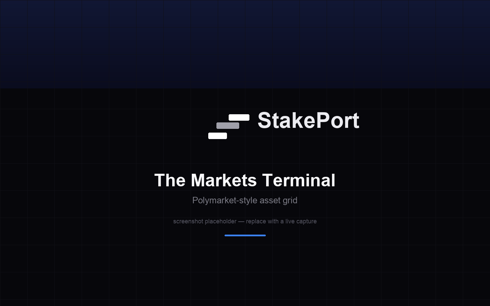 |
| **Cinematic WebGL hero** — an animated shader terrain sets the tone. | **Polymarket-style grid** — dense, filterable, live prices + fair-value spread. |

| The Asset Trading Terminal | The Creator Wizard |
|:---:|:---:|
| 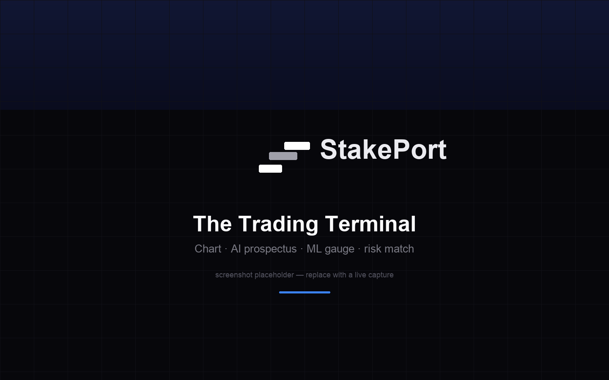 | 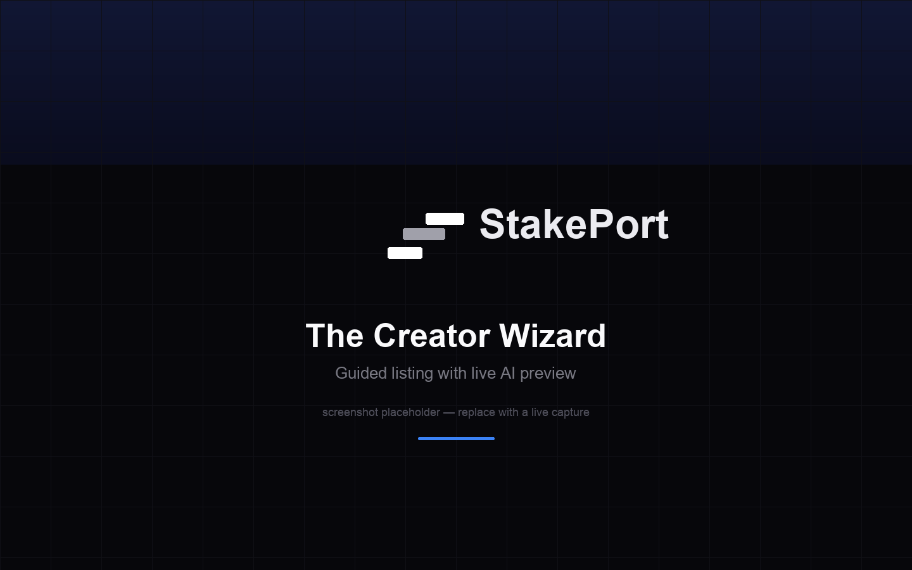 |
| **Chart, AI prospectus, ML gauge, risk match, trade panel** in one view. | **Guided listing** with a live AI prospectus + fair-value pre-check. |

| The Portfolio | The Vault |
|:---:|:---:|
| 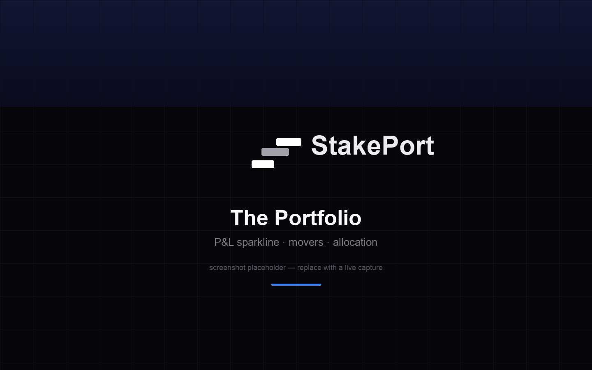 | 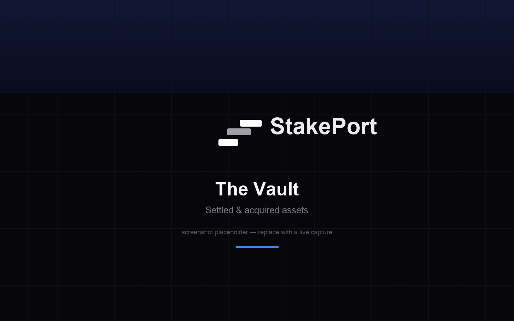 |
| **Real P&L** with a sparkline, top/bottom movers, allocation bar. | **Settled assets** — "100% Acquired" for buyers, realized profit for founders. |

---

## ⚙️ The Mechanism: Three Rails

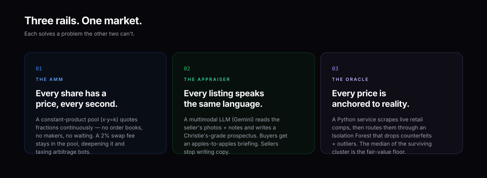

We don't bolt AI onto a DEX. The smart contract, the language model, and the statistical oracle each solve a problem the other two can't — and together they make a market that is **open, transparent, and anchored to reality.**

---

## 🔥 Arbitrage-Enforced Valuation (The Hostile Buyout)

The headline economic primitive. Because the chain can't know an asset's real value, StakePort relies on **trader greed** to peg it.

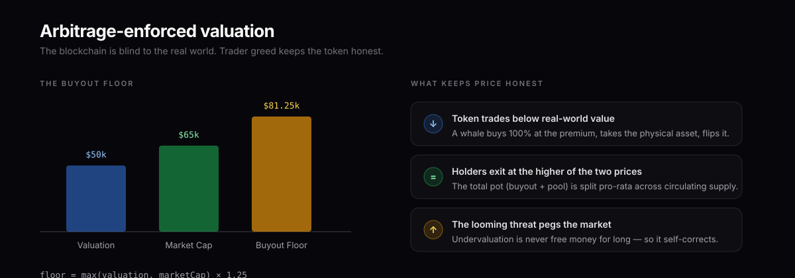

Any whale (not the creator) can acquire **100% of an asset** by paying a **25% premium over the higher of the initial valuation or the current market cap.** Trading halts permanently, the asset is flagged sold, and the entire pot — the buyout money *plus* the AMM's pooled cash — is distributed pro-rata to every token holder. If the token is trading below the asset's real-world worth, this is a profitable arbitrage: buy it all, take the physical object, flip it. That looming threat is what forces the token to trade at fair value.

> The buyout math (`initiateBuyout`) was meticulously balanced to fix a critical economic exploit (the "Robin Hood Bug," where the creator's own liquidity was accidentally paid out to retail as a free dividend). See [Smart Contract Internals](#-smart-contract-internals).

---

## 🔄 The Asset Lifecycle

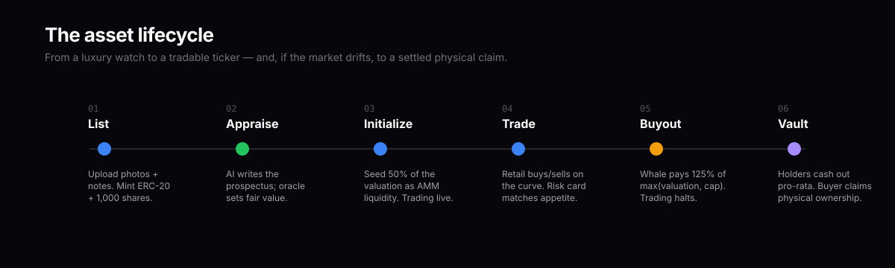

Every asset travels the same path — predictable for sellers, transparent for traders, mathematically fair for everyone holding at exit.

---

## ✨ Feature Highlights

| | Feature | What it does |
|:---:|---|---|
| 💧 | **AMM Trading** | Constant-product (`x·y=k`) pool prices every fraction continuously. A **2% swap fee stays in the pool**, deepening liquidity and taxing arbitrage bots. |
| 🖼️ | **AI Appraiser** | Gemini multimodal reads imagery + notes → a standardized Christie's-grade prospectus, cached per asset. |
| 📊 | **ML Quant Oracle** | Isolation Forest over live SerpAPI retail comps → a denoised fair-value floor. |
| 🛡️ | **Risk Alignment** | A gradient-boosted classifier scores each asset's risk tier and matches it to *your* onboarding-declared appetite, in plain language. |
| 🔒 | **Creator Vesting** | Founder shares are locked from selling for 60 days (anti-rug) — but a hostile buyout still liquidates them in full. |
| 🏛️ | **The Vault** | Post-buyout, settled assets get a home: "100% Acquired · Physical Ownership" for buyers, "Sold / Liquidated" + realized profit for creators. |
| 📈 | **Portfolio P&L** | Real cost-basis tracking (incl. founder baseline), an unrealized-P&L sparkline, top/bottom movers, and an allocation breakdown. |
| 🔐 | **SIWE Auth** | Sign-In With Ethereum + JWT session — gasless signature, no passwords. |

---

## 🧠 The AI / ML Stack

Three distinct models, each the right tool for its job.

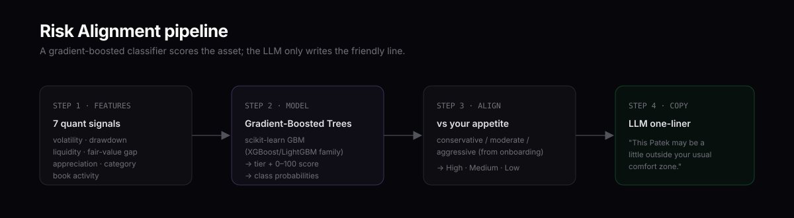

### 1 · The Appraiser — Multimodal LLM

On listing, Gemini scans the raw imagery and the seller's notes and produces a professional 2-paragraph investment prospectus. This removes the copywriting burden from sellers and standardizes listing quality across the platform.

### 2 · The Oracle — Isolation Forest

Raw web data is noisy — counterfeits, spare parts, spam. We route scraped retail prices through an **Isolation Forest** anomaly detector that mathematically isolates the legitimate price cluster, drops the outliers, and outputs the **median as the fair-value floor.**

```python
# ai-engine/main.py  —  the ML oracle in a nutshell
clf = IsolationForest(contamination=0.2, random_state=42)
predictions = clf.fit_predict(np.array(raw_prices).reshape(-1, 1))
valid_prices = [p for p, keep in zip(raw_prices, predictions) if keep == 1]
predicted_fair_value = float(np.median(valid_prices))
```

### 3 · The Risk Classifier — Gradient-Boosted Trees

Risk classification is a *tabular* problem (volatility, drawdown, liquidity…), so we use scikit-learn's `GradientBoostingClassifier` — the XGBoost/LightGBM family. Because a fresh exchange has no labelled history, we **cold-start** it on synthetically-generated, domain-labelled examples, then let the model generalize. It emits a 0–100 score and a tier; the LLM only writes the friendly one-liner.

```python
# ai-engine/risk_engine.py  —  7 quant features → tier + score
features = extract_features(price_history, category, valuation, fair_value, liquidity_usdc)
proba = model.predict_proba(features.reshape(1, -1))[0]
score = float(np.dot(proba, TIER_CENTROIDS))        # smooth 0–100
tier  = TIERS[int(np.argmax(proba))]                # conservative | moderate | aggressive
```

---

## 📜 Smart Contract Internals

Three contracts: `MockUSDC` (testnet faucet currency), `AssetFactory` (deploys markets), and `TradeableAsset` (the ERC-20 + AMM + buyout engine). A few pieces worth highlighting:

**The 2% swap fee that deepens the pool** — the full input enters the pool, but only 98% drives the curve, so the fee becomes permanent reserve depth:

```solidity
// buyTokens() — the fee stays in the pool, it does NOT go to a dev wallet
uint256 usdcInputAfterFee = (usdcInput * (BPS_DENOMINATOR - SWAP_FEE_BPS)) / BPS_DENOMINATOR;
uint256 k = tokenReserve * usdcReserve;
uint256 tokensOut = tokenReserve - (k / (usdcReserve + usdcInputAfterFee));
require(paymentToken.transferFrom(msg.sender, address(this), usdcInput), "USDC transfer failed"); // FULL input in
```

**Creator vesting with a buyout exception** — the founder can't dump, but a whale can still liquidate them:

```solidity
// sellTokens() gates only the creator; cashOut() (used by buyouts) never checks the lock
if (msg.sender == owner()) {
    require(!isCreatorLocked(), "Creator shares locked (anti-rug vesting)");
}
```

**The "Everything Pot" buyout payout** — the exact sequence that fixed the economic exploit:

```solidity
uint256 totalPot = paymentToken.balanceOf(address(this));     // buyout $ + pooled $
finalCashPerToken = (totalPot * 1e18) / totalSupply();        // fair per-token snapshot
uint256 contractTokenBalance = balanceOf(address(this));      // the pool's own tokens
buyoutShare[owner()] = (contractTokenBalance * finalCashPerToken) / 1e18; // credit the LP
_burn(address(this), contractTokenBalance);                   // so they don't dilute holders
```

All five economic-hardening invariants are covered by tests:

```
TradeableAsset — Phase 9
  ✔ retains the 2% swap fee inside the pool (k grows on a buy)
  ✔ blocks the creator from selling during the lockup
  ✔ lets the creator sell once the lockup elapses
  ✔ lets a non-creator sell freely during the creator lockup
  ✔ EXCEPTION: a hostile buyout still liquidates the locked creator
```

---

## 🏗️ Architecture

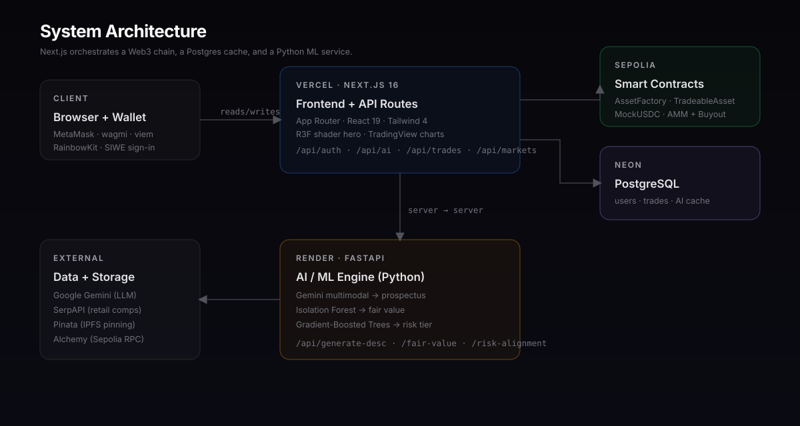

The Next.js app is the orchestrator. The browser talks to the chain directly (wagmi/viem) for trades; server API routes talk **server-to-server** to Postgres (cache), the Python engine (AI/ML), and external services (Gemini, SerpAPI, Pinata). All expensive AI/ML results are cached in Postgres so page loads don't re-burn credits.

---

## 🧰 Tech Stack

| Layer | Technologies |
|---|---|
| **Frontend** | Next.js 16 (App Router), React 19, TypeScript, Tailwind CSS 4, Framer Motion, React-Three-Fiber (WebGL), Recharts, `lightweight-charts` |
| **Web3** | wagmi 2, viem 2, RainbowKit, SIWE + `jose` (JWT) |
| **Contracts** | Solidity 0.8.28, Hardhat, OpenZeppelin 5, TypeChain |
| **Backend / DB** | Next API routes, Prisma 6, PostgreSQL (Neon) |
| **AI / ML** | Python, FastAPI, Google Gemini, SerpAPI, scikit-learn (Isolation Forest + Gradient Boosting), NumPy, Pillow |
| **Infra** | Vercel (frontend), Render (AI engine), Neon (DB), Sepolia (chain), Pinata (IPFS), Alchemy (RPC) |

---

## 📁 Repository Structure

```
StakePort/
├── contracts/            # Hardhat — Solidity + tests + deploy scripts
│   ├── contracts/        #   TradeableAsset · AssetFactory · MockUSDC
│   ├── scripts/deploy.ts #   deploys + prints the frontend env block
│   └── test/Phase9.ts    #   fee / vesting / buyout invariants
├── ai-engine/            # FastAPI microservice
│   ├── main.py           #   /generate-desc · /fair-value · /risk-alignment
│   ├── risk_engine.py    #   gradient-boosted risk classifier
│   └── render.yaml       #   Render deploy blueprint
├── frontend/             # Next.js app
│   ├── prisma/schema.prisma
│   └── src/
│       ├── app/          #   routes + /api routes
│       ├── components/   #   UI (landing, trading terminal, vault, …)
│       └── lib/          #   env, auth, db, viem/rpc clients
├── assets/               # README diagrams + screenshots
└── DEPLOYMENT.md         # full production playbook
```

---

## 🚀 Getting Started (Local)

**Prerequisites:** Node 20+, Python 3.12+, a MetaMask wallet, and free keys for [Gemini](https://aistudio.google.com/apikey), [SerpAPI](https://serpapi.com), and [Pinata](https://app.pinata.cloud). A [Neon](https://neon.tech) Postgres URL (a dev branch works for local too).

```bash
git clone https://github.com/AryanAT13/StakePort.git
cd StakePort
```

**1 · Contracts (local Hardhat node)**
```bash
cd contracts
npm install
npx hardhat node                       # terminal 1: local chain
npm run deploy:local                   # terminal 2: deploy + copy the printed addresses
```

**2 · AI engine**
```bash
cd ../ai-engine
python -m venv venv && source venv/bin/activate
pip install -r requirements.txt
cp .env.example .env                   # add GEMINI_API_KEY + SERPAPI_KEY
uvicorn main:app --port 8000
```

**3 · Frontend**
```bash
cd ../frontend
npm install
cp .env.example .env.local             # fill in the values below
npm run db:push                        # create Postgres tables
npm run dev                            # → http://localhost:3000
```

### Environment Variables (frontend)

| Variable | Purpose |
|---|---|
| `DATABASE_URL` / `DIRECT_URL` | Neon Postgres (pooled / direct) |
| `NEXT_PUBLIC_CHAIN_ID` | `31337` local · `11155111` Sepolia |
| `NEXT_PUBLIC_RPC_URL` | Local node or Alchemy Sepolia endpoint |
| `NEXT_PUBLIC_MOCK_USDC_ADDRESS` / `NEXT_PUBLIC_ASSET_FACTORY_ADDRESS` | From the deploy step |
| `JWT_SECRET` | `openssl rand -hex 32` |
| `PINATA_JWT` | IPFS pinning |
| `AI_ENGINE_URL` | The FastAPI service URL |

> Full list + production values are documented in [`frontend/.env.example`](frontend/.env.example).

---

## ☁️ Deployment

Going live moves off localhost entirely — **Vercel** (frontend), **Render** (AI engine), **Neon** (Postgres), and **Sepolia** (contracts), all on free tiers. The complete step-by-step — accounts to create, which keys to generate vs reuse, exact env-var tables for each service, and free-tier gotchas — is in:

### 👉 **[DEPLOYMENT.md](DEPLOYMENT.md)**

---

## 🗺️ Roadmap

- [ ] Realized P&L (track sells, not just unrealized)
- [ ] Live buyout-window notifications
- [ ] Retrain the risk model on real accumulated trade data
- [ ] Order-history / activity page per wallet
- [ ] Multi-chain deployment (Base, Arbitrum)
- [ ] Mobile-wallet support via WalletConnect project id

---

## ⚠️ Disclaimer

StakePort is a **testnet demonstration** running on Sepolia with mock USDC. It is not audited, not deployed to mainnet, and **not financial advice.** The "assets" are illustrative; no real physical goods are escrowed. Do not use with real funds.

## 📄 License

MIT © StakePort. See [LICENSE](LICENSE).

<div align="center">
<br/>
<sub>Real wealth deserves real markets.</sub>
</div>
